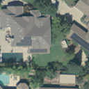
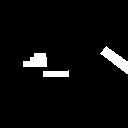
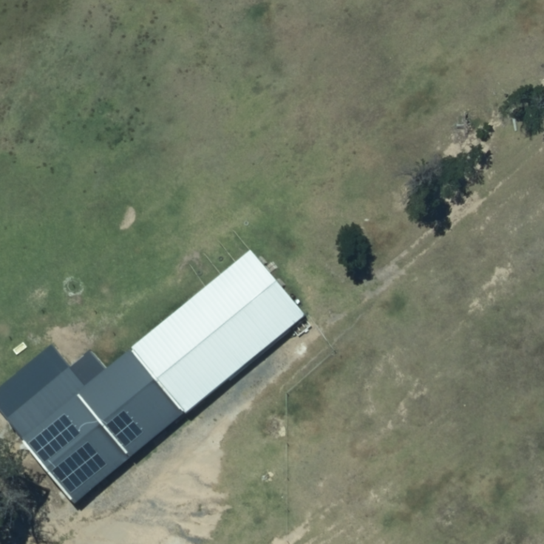

# Data Preparation

## California Dataset
To generate image-mask pairs of the California dataset, you can follow the instructions in this [repo](https://github.com/A-Stangeland/SolarDetection) or follow the instructions below.

1. Edit the configuration file `./data/datagen_config_california.json` 

* ```image_path```: Path to the satellite images (str)
* ```json_path```: Path to JSON file containing the panel polygons (str)
* ```dataset_path```: Path to where the dataset will be created (str)
* ```gers```: Set to `true` if generating from Gers data (Bool)
* ```image_size```: Generated image sample size, samples will be ```image_size``` by ```image_size``` pixels in size (int)
* ```shuffle```: Shuffle after generating samples (Bool)
* ```test_split```: Ratio of samples in the test set (Float)


2. Run the `./data/data_generation_california.py` script by executing the following line:

```python data_generation_california.py```

Note: You should have already downloaded the California data from [here](https://figshare.com/articles/dataset/Distributed_Solar_Photovoltaic_Array_Location_and_Extent_Data_Set_for_Remote_Sensing_Object_Identification/3385780?backTo=/collections/Full_Collection_Distributed_Solar_Photovoltaic_Array_Location_and_Extent_Data_Set_for_Remote_Sensing_Object_Identification/3255643)

Organize the California data folder as follows:
data/
├── Fresno/
├── metadata/
├── Modesto/
├── Oxnard/
└── Stockton/


### Sample California image-mask pair
<p align="center">
  
  
</p>


## Cape Town Dataset
To generate image-mask pairs for the Cape Town images, we first need to preprocess the annotations and create a comprehensive GeoDataFrame that includes all the relevant details of the polygon annotations. This GeoDataFrame follows the same structure as the one provided with the California dataset in the metadata folder. For the full details of the annotation processing steps, please refer to the `data_processing_cape_town.ipynb` notebook. The final GeoDataFrame is saved in `./data/annotations_final.geojson`. Sample image-mask pairs can be found in the `sample_cape_town_dataset` folder.


### Sample Cape Town image mask pair 

<p align="center">
  
  
</p>


# Training 
The segmentation model used for training is the U-Net. The details of the training on the California dataset and the results can be found in the `segmentation.ipynb` notebook.

